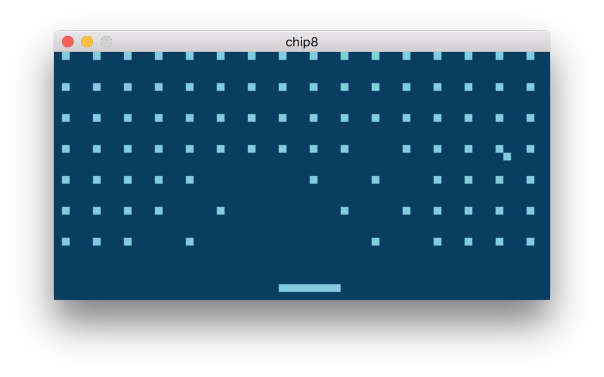

# CHIP-8 Emulator



## Build

SDL2 library is required for this emulator to run.
Platform specific guide can be found on SDL2 wiki. On MacOS Homebrew can be used:
```
brew install sdl2
```

After SDL2 library is installed, emulator can be built using Cargo:
```
cargo build --release
```

## Run

Emulator accepts one command line argument - path to CHIP-8 ROM to run:
```
./emulator roms/wipeoff.ch8
```

Alternatively emulator can be run using Cargo:
```
cargo run --release -- roms/wipeoff.ch8
```

## Controls

I have tested several ROMs:

- `roms/wipeoff.ch8`. Use key `q` to go left and key `e` to go right
- `roms/pong_single_player.ch8`. Use `1` to go up and `q` to down

Others are quite mysterious for me. To quit the game use `Esc` or just close the window.

## TODO

1. Error handling could be better. There are a lot of `.unwrap()`s in UI code for example
2. Screen is blinking a little bit. I have tried reducing refresh frequency but unfortunately is does not help